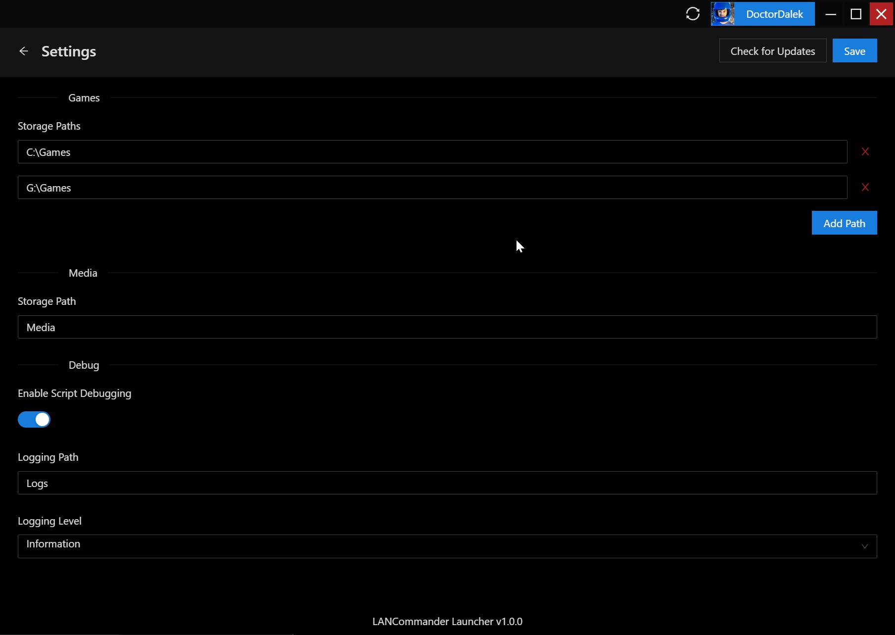

# Launcher
## Overview
The official LANCommander launcher is a desktop application built in ASP.NET Blazor and was designed to be easy to use and familiar. By providing a custom launcher, LANCommander is able to provide a tight integration between the server and any authenticated client.

## Logging In
When opening the launcher for the first time, users will be presented with an authentication screen. From here they will have to enter the LANCommander server address and their credentials. If the launcher is running on the same network as the server, the **Discovered Servers** pane will show any available servers (if beaconing is enabled. See [Server / Settings](/docs/Server/Settings) for more details).

If the user does not have an account registered on the server, they can register either directly in-launcher by clicking the **Register** button, or the server's web UI.

After logging in, the launcher will immediately start syncing the user's accessible games from the server. Once the sync is complete the user is free to start installing any games listed.

## Changing the Install Location
By default, the launcher will install games to `C:\Games` on Windows. This can be changed in settings by hovering over your username in the top right and clicking **Settings** in the dropdown.

If you have more than one storage path specified for games, you will be asked upon install which path you would like to install the game to.

## Filtering Games
By clicking the filter icon in the bottom right, you can filter games based on specific criteria. This metadata is pulled in directly from the game's configuration on the server.

## Download Queue
The launcher has the ability to queue up multiple game installs by utilizing a download queue. Simply start installing multiple games and click the bottom bar to see the queue's current progress.

## Refreshing Games
If a new game is available or a user's list of accessible games has changed, click the import button at the top of the application next to the user's name to sync the list of games from the server.

## Script Debugging
Developing scripts for games is often a process of trial and error. When the setting **Enable Script Debugging** is enabled in the launcher, users will be given the ability to execute any configured scripts for a game without having to reinstall.

Additionally, a terminal will show at the bottom of the launcher after the script has executed. This is a limited PowerShell runspace and will allow for basic debugging of scripts and provides a history of the execution. Any variables that were passed into the script are also listed for visibility.

