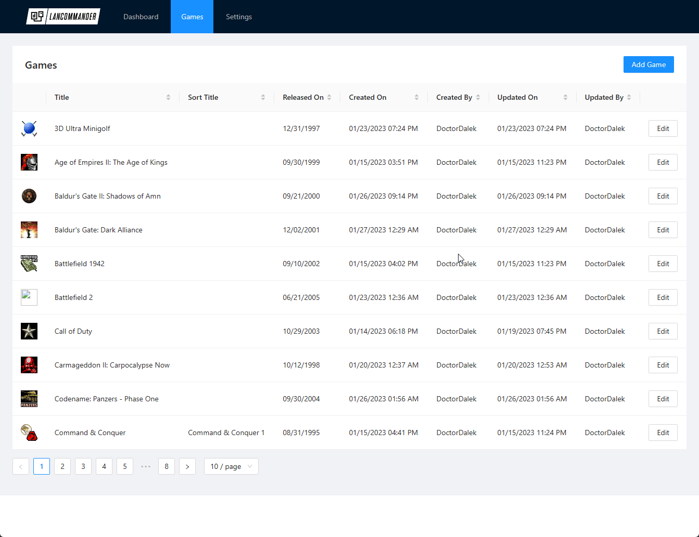
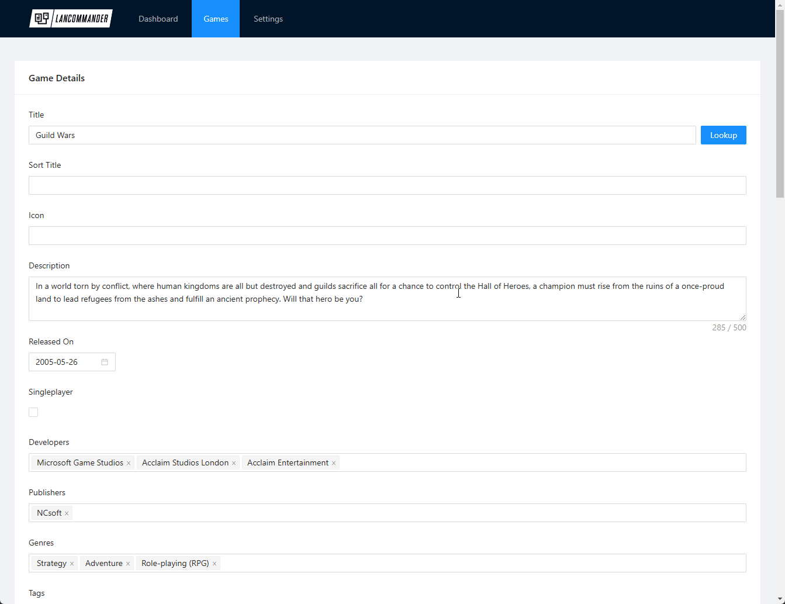
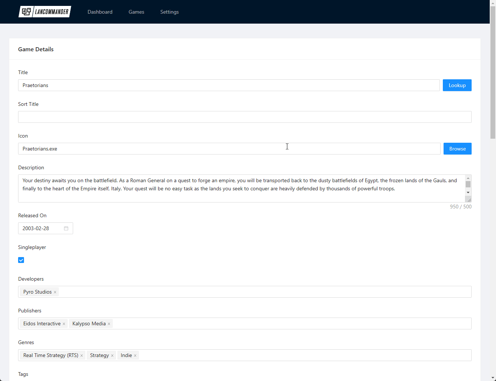
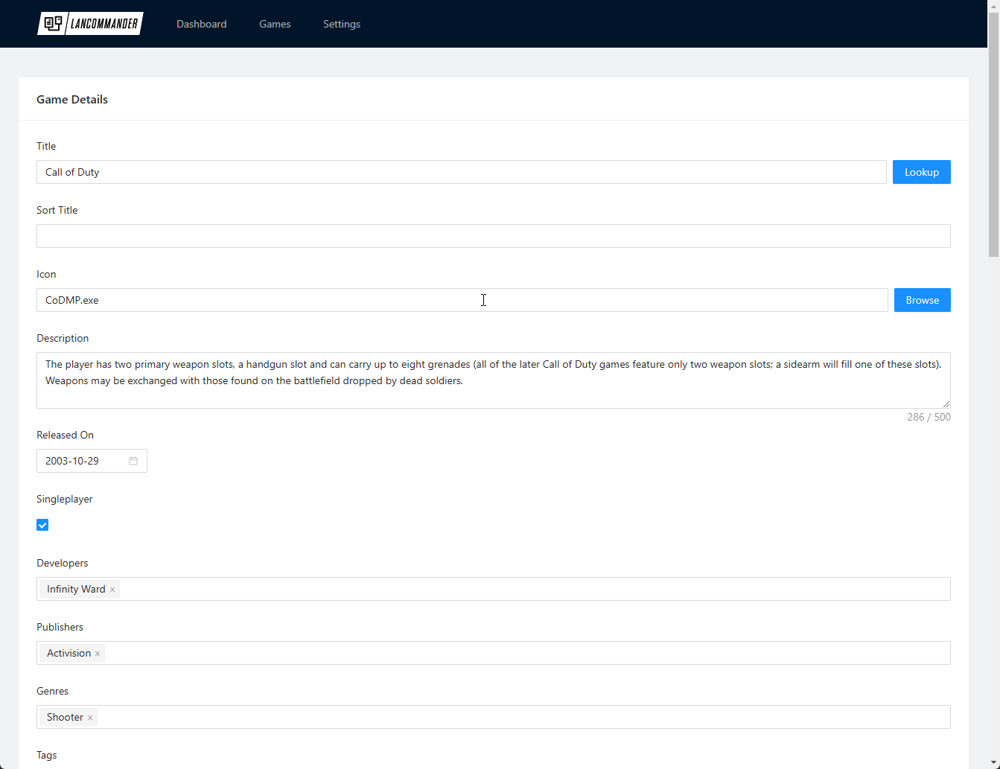
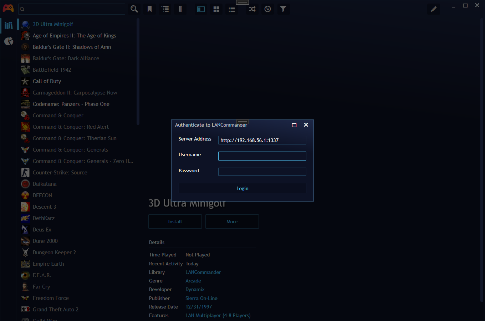
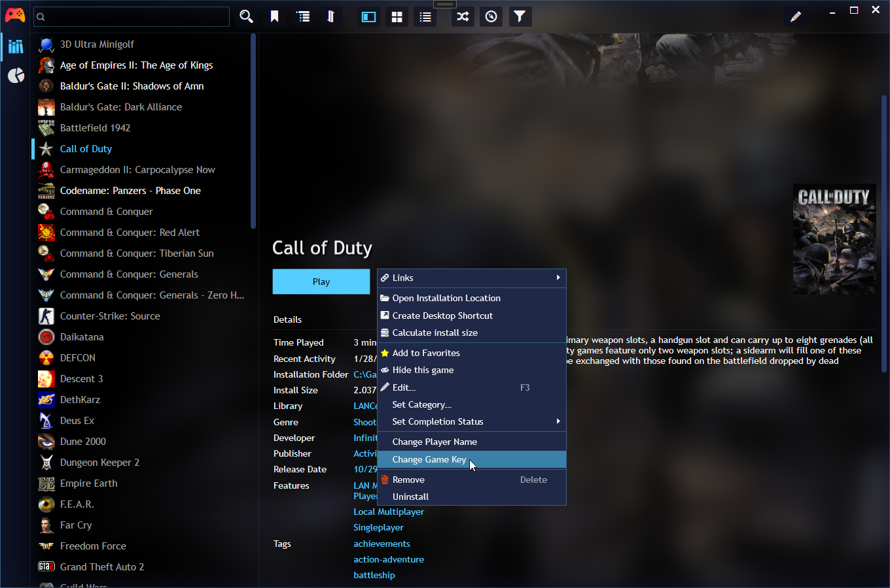
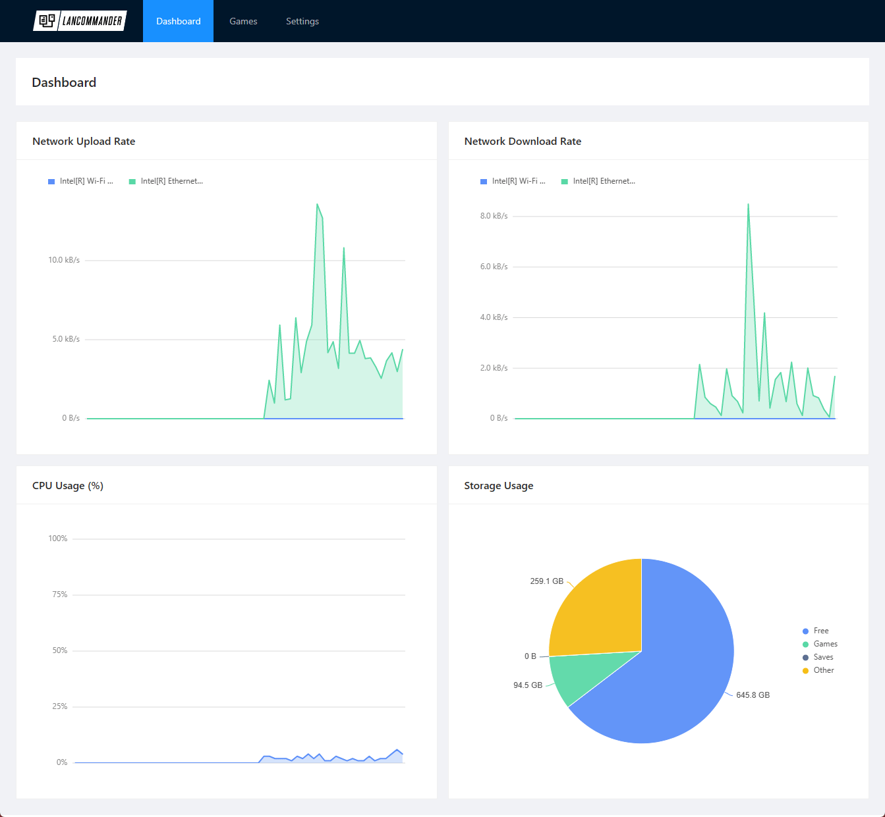

# LANCommander
LANCommander is a digital video game distribution system designed for LAN parties. 

The main application is self-hostable and is built on the ASP.NET Blazor web application framework. Instead of reinventing the wheel with yet-another-game-launcher, client-functionality has been implemented via a Playnite extension. The database is implemented using SQLite so there is no complex setup required.

The platform is designed to work on local networks and loads no assets from the internet. It was originally developed to help assist a LAN party where the local network is closed and no internet access is permitted.

Currently only Windows is supported. This may change in the future and a Docker container may be made available for the main web application.

> Note from the author: I started working on this project years ago because I was fed up with playing IT support while at a LAN party. There's nothing more frustrating than having a group of people together and dealing with issues such as "it says my CD key is invalid" or "server connection blocked: invalid version". Think of LANCommander as DIY Steam.

## Adding Games
After initial setup, go to the "Games" page and click "Add Game". Details provided in this form will be used as metadata for Playnite. Note: games will only show up in Playnite when an archive is available to download.

## Looking Up Metadata
When adding or editing a game, use the Lookup button next to the game's title to query (if configured via Settings) IGDB's database. Basic information about the game will be populated for you. Other information such as total player count in multiplayer modes will also be populated. This information can be used to filter the list of games within Playnite.

## Uploading an Archive
After the initial addition of game you will be able to upload an archive of the game's files. Currently the game's files must put into a compressed ZIP archive. For portable games this is usually pretty simple. For more complex games, you will have to use scripts.

## Scripts
LANCommander supports the addition and management of PowerShell scripts for games that might require a more advanced configuration. Currently the following types of scripts are supported:
 - Install
 - Uninstall
 - Key Change
 - Name Change

Scripts can be useful for games that may require changes to the Windows registry, or prerequisite config files. Here's some examples of scripts that may be useful:

 - Automatically set a game's resolution to the desktop's current resolution
 - Scaffolding of profiles
 - Configuration of favorited servers
 - Additional patches for compatibility

The script editor is pretty fully featured and is based around Microsoft's Monaco editor. Some useful snippets are included and can be inserted into the editor automatically.

## Managing Serial Keys
 You can manage serial keys from the LANCommander web interface. Click the "Edit" button under the Keys section to get a text editor. Each key should be on a separate line. When a key has been allocated, an admin may force that key to be released/unallocated through the web interface.

> Tip: if multiple keys exist for a game (e.g. the base game and its
> expansion packs), create groups of keys separated by commas. Within
> the key change script you can then split by comma to get the
> individual keys.

 
## Authenticating through Playnite
LANCommander includes a Playnite extension, which allows you to install games from your local server. If you are on the same subnet, the server's address will be automatically discovered.

## Installing a Game through Playnite
Once authenticated, the list of games in Playnite will refresh and list the available games added to LANCommander. Click on any of the games and hit the install button. The game will download, extract, and run any post-install scripts defined.

## Changing a Key through Playnite
You can also change your allocated serial key through the Playnite extension. Click the "More" button in Playnite and choose "Change Game Key". If a key is available, it will be allocated to your machine by MAC address and then will run the configured KeyChange script.

## Dashboard
There is also a basic dashboard so you can remotely view the server's network usage, storage allocation, and CPU usage.

## FAQ
### How do I get games?
Do you have a peg leg and a parrot? There is no DRM implementation in LANCommander. The best games are either portable games or DRM-free games. Freeware, shareware, abandonware are all great available options. LANCommander is just a management/distribution system. It does not come bundled with any games.

### I have a pretty large LAN party planned with hundreds of players. I have some sick infrastructure and a LAN cache. What do?
LANCommander communicates over HTTP(S). There is no LAN cache configuration provided, but all downloads are provided through the `/api/Games/{id}/Download` route.

### How do I contribute?
Hit that fork button, submit a PR, there are no hard rules right now.

## To Do
LANCommander is far from complete. The basic implementation that exists will allow you to:

 - Manage games
 - Upload archives
 - Manage scripts
 - Manage keys
 - Download games
 - Basic user management
 - New user registration

The following features are being considered:

 - Local "cloud" user saves
 - Dedicated server management/administration
 - Linux build
 - Some expansion of the dashboard with useful stats
 - Built-in VPN client/server for remote LAN parties
 - Game patching
